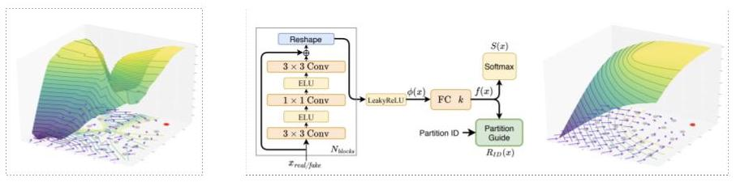

# Partition-Guided GANs

**Partition-Guided GANs** [CVPR](https://openaccess.thecvf.com/content/CVPR2021/html/Armandpour_Partition-Guided_GANs_CVPR_2021_paper.html) |  [Arxiv](https://arxiv.org/abs/2104.00816)| [Video link](https://www.youtube.com/watch?v=thbZCPxWBUg&ab_channel=MohammadRezaArmandpour) <br>
[Mohammad Reza Armandpour* ](https://web.stat.tamu.edu/~armand/),
[Ali Sadeghian* ](https://scholar.google.se/citations?user=0asq4zoAAAAJ&hl=en),
[Chunyuan Li](http://chunyuan.li/),
[Mingyuan Zhou](https://mingyuanzhou.github.io/) <br>
CVPR 2021

<p align="center">
  
</p>

Our proposed fully unsupervised image generation model, PGMGAN, learns to partition the space based on semantic similarity and generate images from
each partition to reduce mode collapse and mode connecting. We propose a novel partitioner/guide method that guarantees to provide direction to the generators
to lead them to their designated region. 
scan_guide_biggan


## Getting Started


<br>

### Installation
- Clone this repo:
```bash
git clone https://github.com/alisadeghian/PGMGAN.git
cd PGMGAN
```

- Install the dependencies
```bash
conda create --name PGMGAN python=3.7
conda activate PGMGAN
conda install --file requirements.txt
conda install -c conda-forge tensorboardx
```
### Training and Evaluation
- Train a model on CIFAR:
```bash
python train.py configs/cifar/scan_guide_biggan.yaml
```

- Visualize samples and inferred clusters:
```bash
python visualize_clusters.py configs/cifar/scan_guide_biggan.yaml --show_clusters
```
The samples and clusters will be saved to `output/cifar/scan_guide_biggan/clusters`.

- Evaluate the model's FID:
You will need to first gather a set of ground truth train set images to compute metrics against.
```bash
python utils/get_gt_imgs.py --cifar
```

Then, run the evaluation script:

```bash
python metrics.py configs/cifar/scan_guide_biggan.yaml --fid --every -1
```
You can also evaluate with other metrics by appending additional flags, such as Inception Score (`--inception`), the number of covered modes + reverse-KL divergence (`--modes`), and cluster metrics (`--cluster_metrics`).

## Pretrained Models

Appologise for the inconvenience, we lost access to the server where we store the pretrained models. We will be re-running and uploading them soon. EDIT: CIFAR models added.

You can download pretrained models on CIFAR from [here](https://drive.google.com/drive/folders/1lsZKU6T0H91ThW_lCpsEJNGg0rTYGBcY?usp=sharing) and place them in the `output/cifar/scan_guide_biggan/chkpts/` directory.

To reproduce the results in the paper use the following command:

```bash
python metrics.py configs/cifar/scan_guide_biggan.yaml --fid --every -1
```

## Evaluation
### Visualizations

To visualize generated samples and inferred clusters, run
```bash
python visualize_clusters.py config-file
```
You can set the flag `--show_clusters` to also visualize the real inferred clusters, but this requires that you have a path to training set images.

### Metrics
To obtain generation metrics, fill in the path to your ImageNet or Places dataset directories in `utils/get_gt_imgs.py` and then run
```bash
python utils/get_gt_imgs.py --imagenet --places
```
to precompute batches of GT images for FID/FSD evaluation.

Then, you can use
```bash
python metrics.py config-file
```
with the appropriate flags compute the FID (`--fid`), FSD (`--fsd`), IS (`--inception`), number of modes covered/ reverse-KL divergence (`--modes`) and clustering metrics (`--cluster_metrics`) for each of the checkpoints.

## Acknowledgments
This code is heavily based on the [GAN-stability](https://github.com/LMescheder/GAN_stability) and [self-cond-gan](https://github.com/stevliu/self-conditioned-gan) code bases.
Our FSD code is taken from the [GANseeing](https://github.com/davidbau/ganseeing) work.
To compute inception score, we use the code provided from [Shichang Tang](https://github.com/tsc2017/Inception-Score.git).
To compute FID, we use the code provided from [TTUR](https://github.com/bioinf-jku/TTUR).
We also use pretrained classifiers given by the [pytorch-playground](https://github.com/aaron-xichen/pytorch-playground).

We thank all the authors for their useful code.

## Citation
If you use this code for your research, please cite the following work.
```
@inproceedings{armandpour2021partition,
  title={Partition-Guided GANs},
  author={Armandpour, Mohammadreza and Sadeghian, Ali and Li, Chunyuan and Zhou, Mingyuan},
  booktitle={Proceedings of the IEEE/CVF Conference on Computer Vision and Pattern Recognition},
  pages={5099--5109},
  year={2021}
}
```
